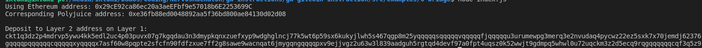

1. A screenshot of the console output immediately after you have successfully generated your Deposit Receiver Address.

2. Your Deposit Receiver Address (in text format).

ckt1q3dz2p4mdrvp5ywu4kk5edl2uc4p03puvx07g7kgqdau3n3dmypkqnxzuefxyp9wdghglncj77k5wt6p59sx6kukyjlwh5s467qgp8m25yqqqqqsqqqqqvqqqqqfjqqqqqu3urumewpg3merq3e2nvudaq4pycwz22ez5sxk7x70jemdj62376gqqqqpqqqqqqcqqqqqxyqqqqx7asf60w8pqpte2sfcfn90fdfzxue7ff2g8sawe9wacnqat6jmygqngqqqqpxv9ejjvgz2u63w3l839aadguh5rgtqd4devf97a0fpt4uqsz0k52wwjt9gdmpq5whwl0u72uqckm3z2d5ecq9rqgqqqqqqcqf3q5z9

3. The Ethereum address used to generate the Deposit Receiver Address (in text format).

0x29cE92ca86ec20a3aeEFbf9e57018b6E2253699C

4. A link to the Etherscan explorer for the successful Force Bridge transaction. This can be found on Force Bridge under History→Succeed.

https://rinkeby.etherscan.io/tx/0xe1f89a8b4ed08eb6f8f7894ea0feecc57ea9b7cd08611343b2b5f0235e6b91e3

5. A link to the Nervos explorer for the successful Force bridge transaction. This can be found on Force Bridge under History→Succeed.

https://explorer.nervos.org/aggron/transaction/0x2a46683afcb4422a95c67455b9aba3d457f96d27f7ab35d886da98411e793059